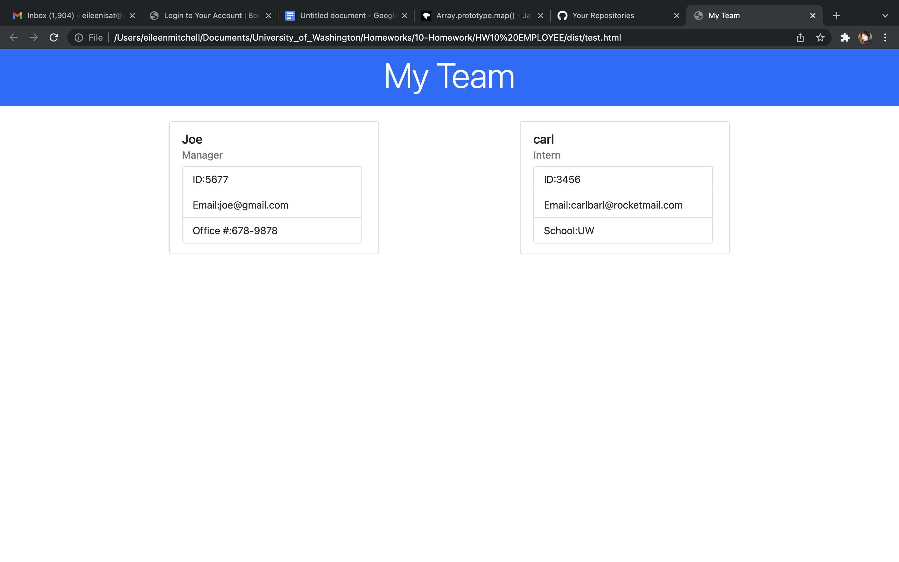

# README - TEAM PROFILE GENERATOR

By: Eileen Mitchell
- AN APPLICATION TO GENERATE AND TEST BACK-END EMPLOYEE PROFILES

# Technologies Used
- HTML
- CSS
- JAVASCRIPT
- JQUERY
- BOOTSTRAP 4.5.0
- NODE

# Description
This application allows users to create a websites employer and employee profile, update front end webpage layouts, and test outputs. Rendered data from js files are rendered dynamically to an easy to read user interface. This card can be updated as needed and can be used to track business information without affecting the overall code of an application. Questions are presented on the index.js file that will prompt the user to input relevant information that can be used for the rest of the application.

# Known Bugs
- package.json file has limited data besides the "jest" package. Unsure if this has affected employee test results. 
- Switch cases were attempted but not achieved. Future renditions should include a switch case to further streamline code content within the buildTeam() function. 
- There is no error used in this application. Future renditions should include an error.
- There is no option for multiple managers in this application. Future renditions should include this as an option, as we do not know the make up of any organization and should not make prior assumptions.

# Links
- [main.html](./dist/main.html)
- [test.html](./dist/test.html)
- [employee.js](./lib/employee.js)
- [engineer.js](./lib/engineer.js)
- [html.js](./lib/html.js)
- [intern.js](./lib/intern.js)
- [main.js](./lib/main.js)
- [manager.js](./lib/manager.js)
- [employee.test.js](./tests/employee.test.js)
- [engineer.tests.js](./tests/engineer.test.js)
- [intern.tests.js](./tests/intern.test.js)
- [manager.tests.js](./tests/manager.test.js)
- [index.js](./index.js)
- [package-lock 2.json](package-lock-2.json)
- [package-lock.json](./package-lock.json)
- [package.json](./package.json)

# Screen Shots

